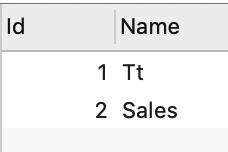

### 任务3
#### 各部门工资最高的员工
* Employee 表包含所有员工信息， 每个员工有其对应的 id, salary, departmentId

* Department 表包含公司所有部门的信息

* 查询各部门工资最高的员工
```
SELECT e.name AS Employee, e.Salary, d.name AS Department
FROM Employee AS e, Department AS d
WHERE salary IN (
	SELECT MAX(salary) FROM Employee AS E
	WHERE E.DepartmentId = d.id
);

```